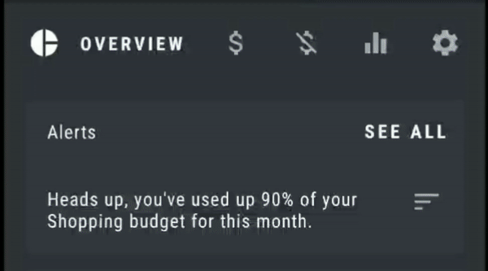
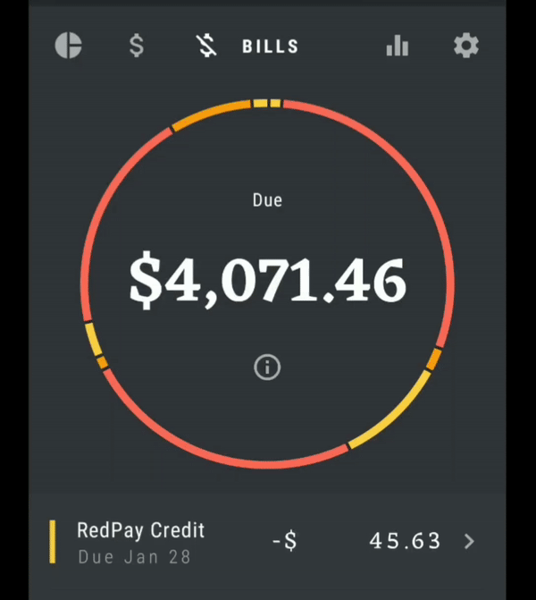
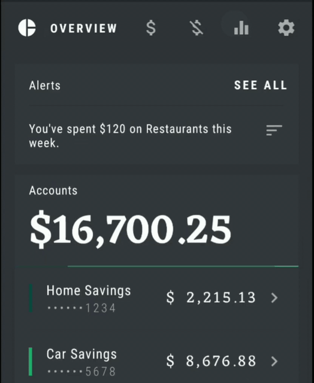
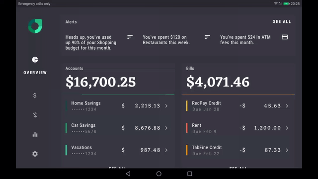

# Rally

[Rally](https://material.io/design/material-studies/rally.html) is a personal finance app that uses Material Design components and Material Theming to create an on-brand experience with a data-driven aesthetic.

*Ref: [material.io](https://material.io)*    

Rally is a part of Google's Material Studies. It is originally a design case study and no codes.

So, we tried to implement the app for Android. We craft it looks like design as close as possible and customize a lot of UI components and use [Material Components](https://github.com/material-components/material-components-android) for theming.    

Here are some highlights:

### [RallyTab](https://github.com/hashlin/rally/blob/master/app/src/main/java/io/material/rally/ui/RallyTab.kt)

Such kind of tab is not default on Android. We made it possible by using Constraint Layout's Flow.

***

### [Graphs and Tabs](https://github.com/hashlin/rally/tree/master/rally_scrollable_tab/src/main/java/com/example/rally_scrollable_tab)

Meaningful motions and neat animations make the graph unique. Handcrafted the component on canvas.

***

### [Pie Chart](https://github.com/hashlin/rally/tree/master/rally_pie/src/main/java/io/material/rally_pie)

Pie chart on canvas and make animation exactly the same with original.

***

### Tablet UI

Made Rally unique on tablet, too.

***

Find us on Twitter:

[@Thechanmyaeaung]()

[@Linminphyoe1]()
