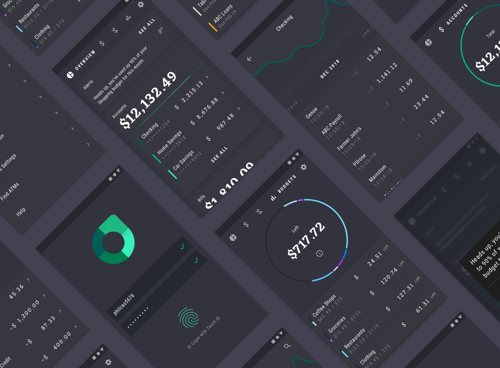

# Rally

[Rally](https://material.io/design/material-studies/rally.html) is a personal finance app that uses Material Design components and Material Theming to create an on-brand experience with a data-driven aesthetic.

*Ref: [material.io](https://material.io)*    

Rally is a part of Google's Material Studies. It is originally a design case study and no codes.

So, we tried to implement the app for Android. We craft it looks like design as close as possible and customize a lot of UI components and use [Material Components](https://github.com/material-components/material-components-android) for theming.    

Here are some highlights:

Such kind of tab is not default on Android. We made it possible by using Constraint Layout's Flow.

Meaningful motions and neat animations make the graph unique. Handcrafted the component on canvas.

<iframe src="https://www.youtube.com/embed/enMumwvLAug" frameborder="0" allowfullscreen="true"> </iframe>

Draw the pie chart on canvas and make animation exactly the same with original.

Made Rally unique on tablet, too.

Find us on Twitter:

[@Thechanmyaeaung]()

[@Linminphyoe1]()
